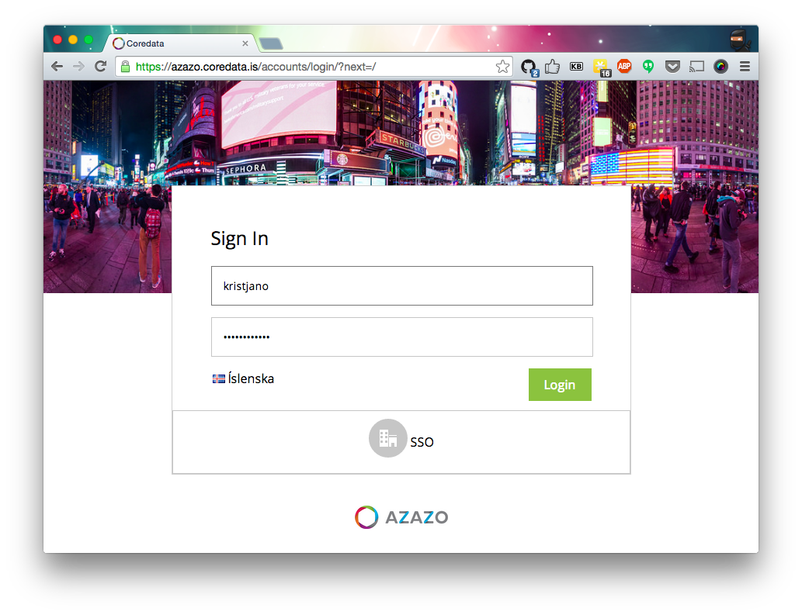

# My .js files

A collection of my .js files. See [defunkt/dotjs](https://github.com/defunkt/dotjs).

## coredata.is.js

Changes the login page image to a random flickr one. You can find example
screenshots [here](coredata-login-screenshots).

## github.com.js

Two things are happening here. 

### Hólmar is a busy github bee.

This plugin is changing all the avatars to images on github to a picture of
Holmar with a color that is hashed from they respected users username (so you
can tell them apart).

### LGTM extension

Generates a button on pull requests to add a random image from my [LGTM
 collection](https://koddsson.github.io/LGTM/).

It looks like this:

